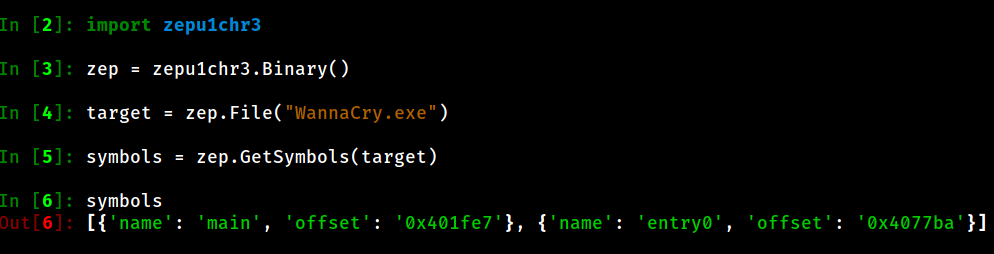
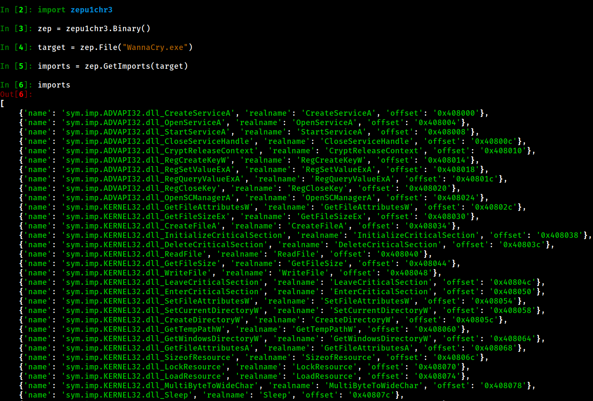
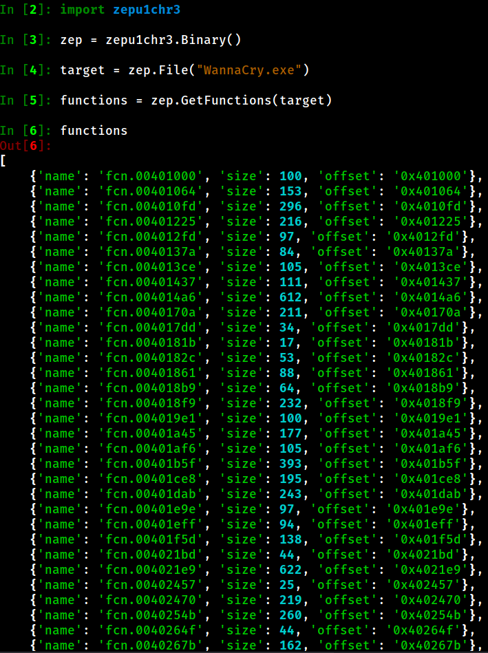
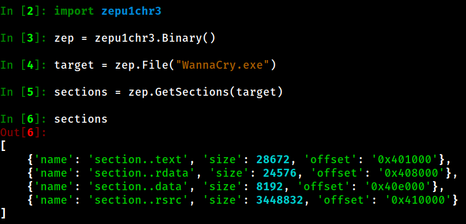
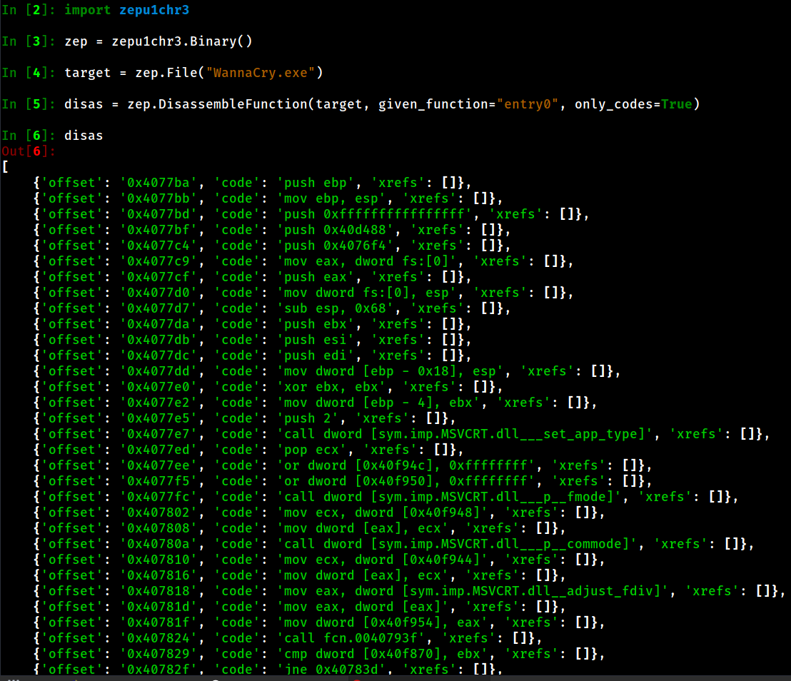
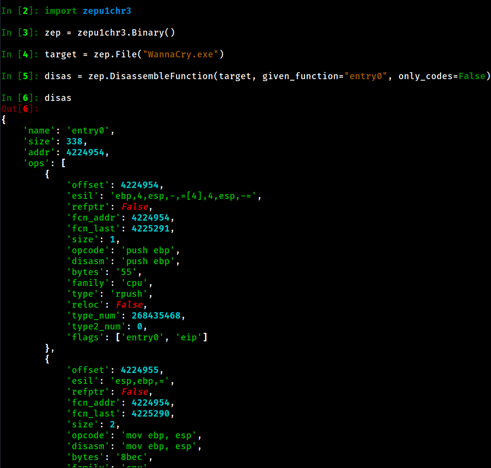

# Zepu1chr3

<br><b>A Radare2 based Python module for Binary Analysis and Reverse Engineering.</b><br>

# Installation
- <i>You can simply run this command.</i>
```bash
pip3 install zepu1chr3
```

# How to Use
## Specifying a target binary
- <i>Description</i>: You can specify any binary file to analysis you want. It returns a handler for target file.<br>
```python
import zepu1chr3

zep = zepu1chr3.Binary()
target = zep.File("WannaCry.exe")
```

## Getting symbols from target binary
- <i>Description</i>: This method will give you what symbols are inside of the target file. It returns an array of symbol information.<br>
```python
import zepu1chr3

zep = zepu1chr3.Binary()
target zep.File("WannaCry.exe")
symbols = zep.GetSymbols(target)
```


## Getting imports from target binary
- <i>Description</i>: This method will give you what imports are inside of the target file. It returns an array of import information.<br>
```python
import zepu1chr3

zep = zepu1chr3.Binary()
target = zep.File("WannaCry.exe")
imports = zep.GetImports(target)
```


## Getting functions from target binary
- <i>Description</i>: This method will give you what functions are inside of the target file. It returns an array of function information.<br>
```python
import zepu1chr3

zep = zepu1chr3.Binary()
target = zep.File("WannaCry.exe")
functions = zep.GetFunctions(target)
```


## Getting sections from target binary
- <i>Description</i>: This method will give you what sections are inside of the target file. It returns an array of section information.<br>
```python
import zepu1chr3

zep = zepu1chr3.Binary()
target = zep.File("WannaCry.exe")
sections = zep.GetSections(target)
```


# Disassembling functions or somethings contained in offsets
## Getting informations about only machine code
- <i>Description</i>: This method will give you disassembled function codes if ```only_codes``` parameter set to ```True```<br>
```python
import zepu1chr3

zep = zepu1chr3.Binary()
target = zep.File("WannaCry.exe")
disas = zep.DisassembleFunction(target, given_function="entry0", only_codes=True)
second = zep.DisassembleFunction(target, given_function="0x401000", only_codes=True) # You can use offsets to!!
```


## Getting every information about machine code (verbose!!)
- <i>Description</i>: If you set ```only_codes``` parameter as ```False``` you will get more verbose output.<br>
```python
import zepu1chr3

zep = zepu1chr3.Binary()
target = zep.File("WannaCry.exe")
disas = zep.DisassembleFunction(target, given_function="entry0", only_codes=False)
```


# Pypi and Other functionalities are coming soon!!
